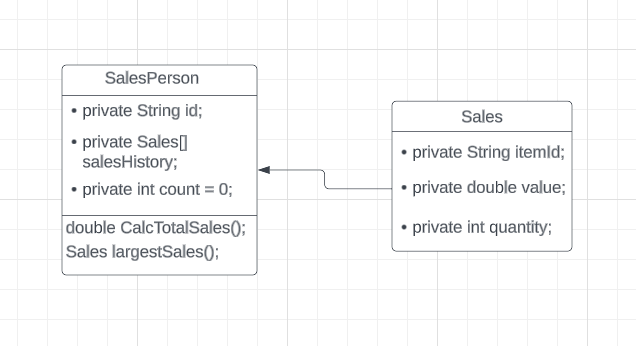
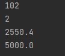

## 1.(a) By making use of an example from the above scenario, distinguish between a class and an instantiation of a class. (3 points)

A class is a template definition of the methods and variables in a particular kind of object while an instantiation of a class is creating a particular object that contains those attributes.

## (b) By giving two examples, explain how the principles of inheritance can be incorporated into the design of this administration program. (4 points)

Example 1: An example of inheritance would be a user profile. In a case where the administration program contains a variety of users (e.g: Administrator, Employee, Director), the users would have to have common traits or attributes such as their idNumber, name, contact information and many others. by creating the base class called "Users", it would allow the variety of users to inherit the properties and attributes of a user while simultaneously having their own special case attributes that is unique to themselves. This promotes code usability which is important in programming as the programmers would not need to create any new lines of code that would decrease the performance of said code.

Example 2: In an administration program, it is important for the program to include file handling. This means that the program needs to be able to handle different file types that serves different purposes. With inheritance, a base class called "File" would be able to be defined to accommodate the common attributes and methods for all file types. This would mean that the different file types would acquire the common attribute as it is a subclass that inherits methods and attributes from the main base class. Ultimately, inheritance is important for code usability and recyclability

## c) Describe how the use of libraries can facilitate the development of programs like this company’s administration program. (3 points)

libraries are referred to as a collection of precompiled functions, classes and modules that can be used to improve to the enhance the functionality of a software application. The main purpose of a library is to provide code reusability and simplify the development process of certain codes. In short terms, the use of libraries would fasten the progression of the code formation and would result in better performance.

## 2(a) Complete the constructor public SalesPerson(String id), from the SalesPerson class. (2 points)
```java
   public SalesPerson(String id) {
        salesHistory = new Sales[100];
        this.id = id;
   }
```

## (b) Explain why accessor methods are necessary for the SalesPerson class. (3 points)

The accesor is needed so that the user could access the private methods and attributes that have been defined.

## (c) (i) Construct unified modelling language (UML) diagrams to clearly show the relationship between the SalesPerson and Sales classes.




## (c) (ii) Outline a negative effect that a future change in the design of the Sales object might have on this suite of programs. (2 points)

One of the biggest negative effects would that whenever there are changes to the design on the object itself, the code would need to be refactored in order for it to run properly again.

## (d) State the output after running this code. (4 points)



## (h) Suggest changes that must be made to the SalesPerson class and/or the Sales class to allow these calculations to be made. (3 points)

The addition of a date variable is compulsory so that it helps us count the salary of each employee each month.

## (i) Discuss the use of polymorphism that occurs in this suite of programs. (3 points)

The use of polymorphism is in the SalesPerson class whereby the method will conclude a different results depending on the parameters of the function.
